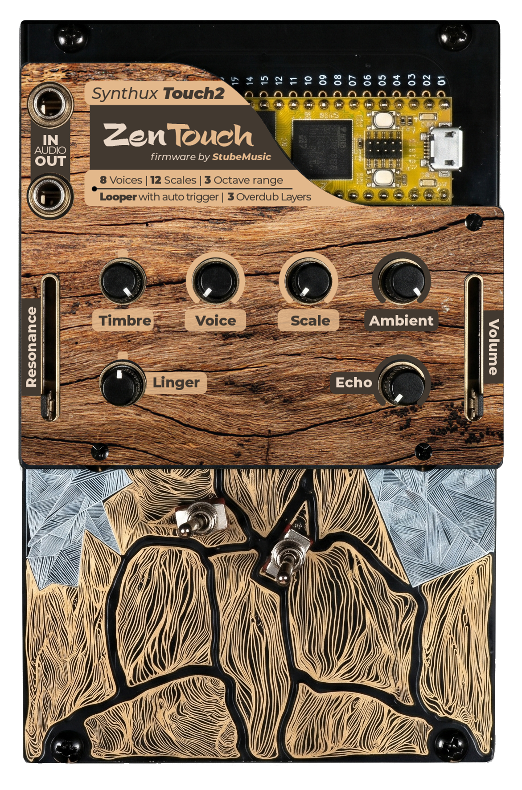
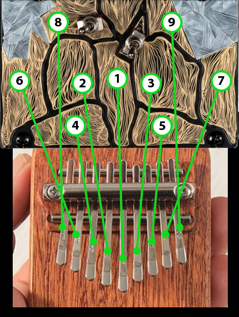
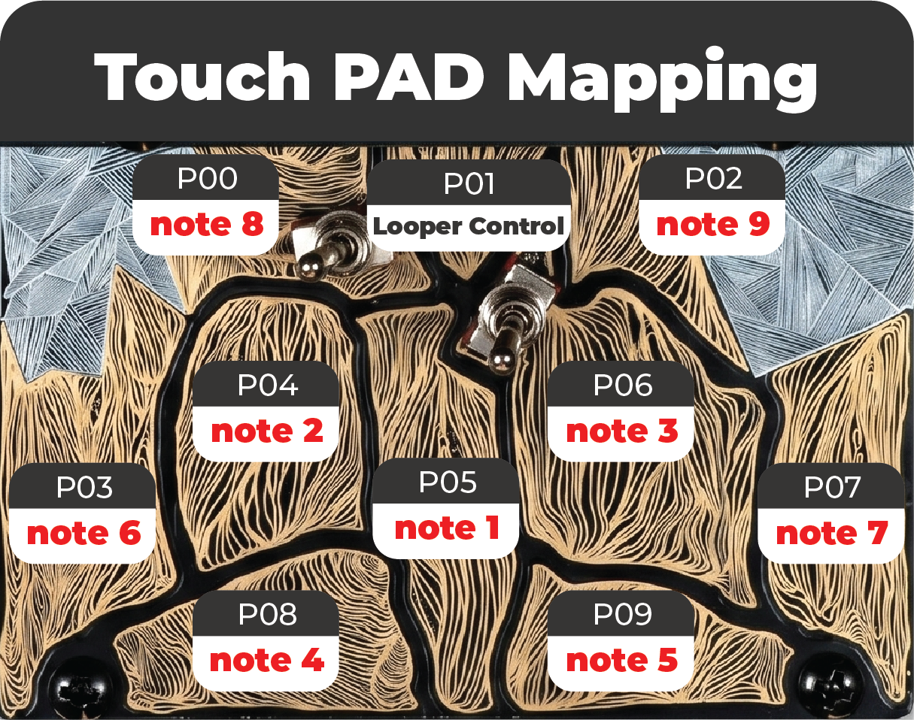
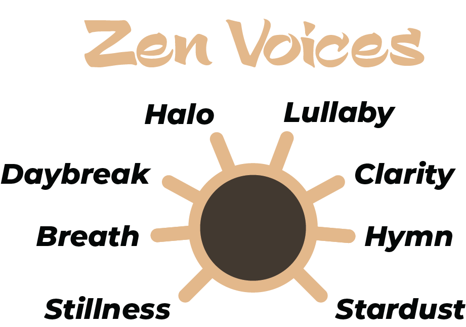
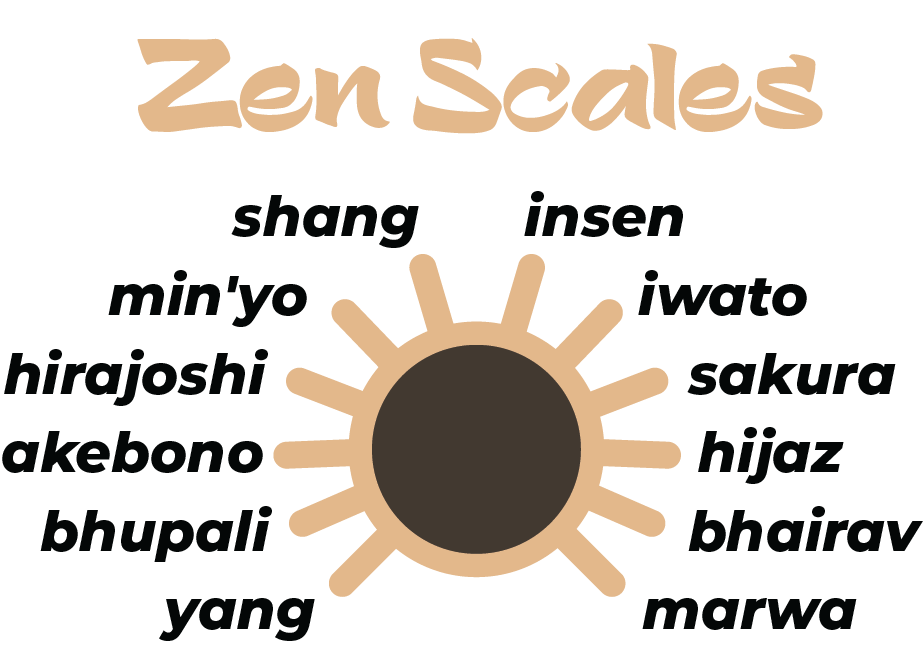
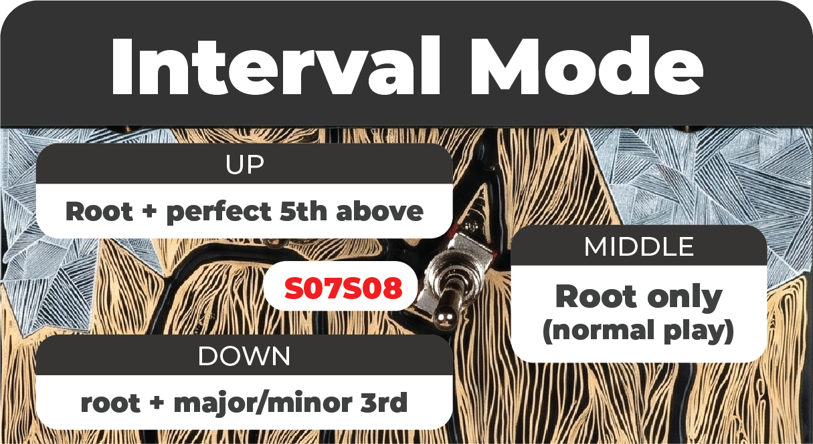
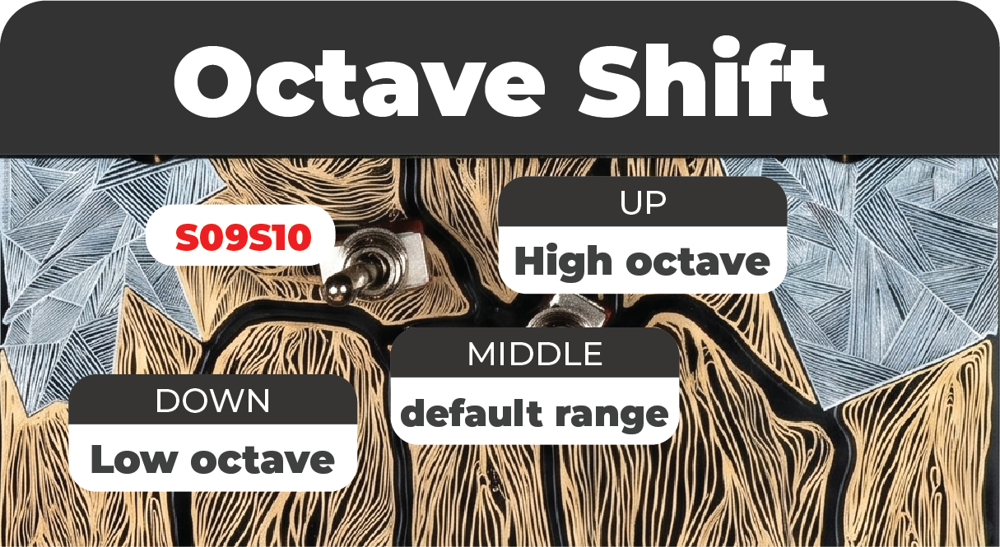

# ZenTouch Firmware for Synthux Touch 2

ZenTouch turns the Synthux Touch 2 (powered by Daisy Seed) into a contemplative nine-tine thumb piano. Eight Karplus-Strong voice slots, a twelve-scale Zen Arc, octave switching, tactile root and interval doubling (perfect fifth or scale-aware third), an audio-buffer looper with three overdub layers that leaves the full voice pool free for live play, and a stereo line-in so two ZenTouch units can be chained for duo jams.

## Interactive Web Manual

**[Explore the Interactive ZenTouch Web Manual](https://zentouch-touch2.vercel.app/)**

The web manual is the full reference for the firmware. It includes an in-browser emulator, the complete control map, voice and scale walkthroughs, a per-pad diagram of the nine tines and looper button, the calibration flow with audio and LED cues, and downloadable faceplates.

---

### Nine tines, kalimba layout

The Touch 2's twelve capacitive pads split into nine playable tines plus a looper button and two silent modifier pads. The scale's root is the centre pad P05; degrees fan out from the centre in an alternating left, right, left, right pattern, exactly like a real kalimba.

### Eight voices, each with its own character

S32 selects one of eight Karplus-Strong voices that share the same synthesis core but each carry a different baseline brightness, damping, non-linearity, and optional character feature: pitch dip on attack, attack swell, tremolo, vibrato, or continuous shimmer noise. The lineup forms a single gradient from tight and natural on the left to open, singing, and textured on the right.

### Twelve scales, the Zen Arc

S33 sweeps across twelve contemplative scales arranged so that each adjacent pair shares most of its pitches. The dial feels like a smooth emotional dimmer rather than a switch, with two intentional mode-shift breakpoints along the way. Coverage: six Japanese, two Chinese, three Indian, and one Arabic scale.

### Tactile interval and octave control

Switch A doubles each tine with a perfect fifth or a scale-aware major or minor third. Switch B shifts new notes one octave up or down. Already-ringing notes keep their original pitch, so live changes never break a sustained gesture.

### Audio-buffer looper that leaves your voice budget alone

P01 records the audio of your performance directly into SDRAM and plays it back through the live FX bus. The big practical win: **loop notes consume zero voices**, so a busy three-overdub loop never steals a melody note from your live playing — the full 5-voice pool is always available for what you play on top. Change voice, scale, timbre, linger, or the switches afterward and live notes pick up the new settings while the loop keeps its original sound (because the audio IS the recording). Sweep Ambient, Echo, Resonance, or Volume and the loop reacts in real time alongside live notes.

Up to one base layer plus three overdub layers, each up to 60 seconds at 48 kHz, around 23 MB of SDRAM total. Modifier pads P10 and P11 add stop and resume, remove the last overdub, and a held-2-second hard clear.

### Calibration that solves per-unit pot tolerance

ZenTouch ships with a calibration system that lives in QSPI flash. On first boot the firmware walks the user through minimum, maximum, centre, and pad-baseline positions, then stores the captured values so that physical noon always reads as 0.5 on every unit, regardless of pot manufacturing tolerance. Re-trigger calibration at any time by holding both switches in the DOWN position at power-on and flipping them to UP within two seconds.

## Download Firmware

You can download the compiled firmware binary right here in the repository:

* **[Download ZenTouch Firmware V2 (.bin)](./ZenTouch-V2.bin)** — **Latest (May 2026)**
* [Download ZenTouch Firmware V1.1 (.bin)](./ZenTouch-V1.1.bin) — previous release, kept available

### What's new in V2

* **Audio-buffer looper.** The looper now records audio directly into SDRAM instead of recording trigger events. The big practical win: loop notes consume zero voices, so a busy three-overdub loop never steals a melody note from your live performance. The gesture map, LED behaviour, and state machine are identical to V1.1 — only the underlying model and the voice-budget feel changed.
* **Stereo line-in enabled.** The line-in pins were unused in V1.1; in V2 they are mixed into the master bus after local FX and before the limiter. Cable Unit A's audio out into Unit B's audio in and Unit B's listener hears both performances. One-way only (do not wire B's output back into A's input — that creates a feedback loop the limiter can clamp but not break).
* **Calibration confirmation gesture.** Each step of the calibration flow now confirms with both switches at CENTER (instead of DOWN), so the device starts normal play in the neutral musical state.
* **Loop length cap of 60 seconds per layer.** If you keep recording past that, RECORDING auto-closes silently and the loop length is pegged to the buffer. Plenty of headroom for kalimba textures.

V1.1 is kept available so anyone already happy with the event-based looper can keep using it. Loops created in V1.1 do not carry forward (loops are session-scoped in both versions — they reset on power-down regardless).

## How to Install

1. Connect your Daisy Seed (inside the Synthux Touch 2) to your computer via USB.
2. Put the Daisy Seed into bootloader mode:
   - Hold the **BOOT** button on the Daisy.
   - Press the **RESET** button.
   - Release the **RESET** button.
   - Release the **BOOT** button.
3. Flash the `.bin` file using the [Daisy Web Programmer](https://electro-smith.github.io/Programmer/) or your preferred Daisy flashing tool.
4. On first boot, the firmware enters calibration automatically. Follow the LED and audio prompts to set minimum, maximum, centre, and pad positions for your unit. The calibration is written to QSPI flash and loads silently on every subsequent boot.

---

*A firmware by StubeMusic for Synthux Touch 2*

## Printable Paper Templates

PDF templates ready to print and overlay on the Touch 2 faceplate.

**Important: print at actual size with no scaling, so the plate stays at the correct width.**

* [ZenTouchWood.pdf](./toPrint/ZenTouchWood.pdf)
* [ZenTouchBlack.pdf](./toPrint/ZenTouchBlack.pdf)
